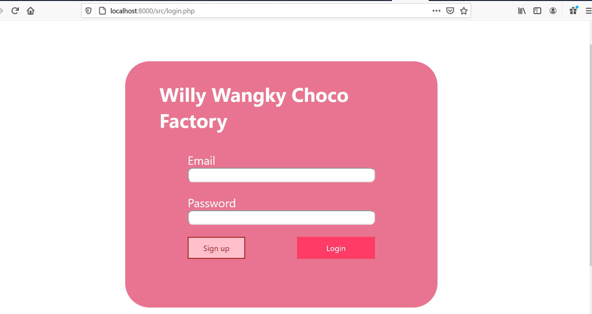
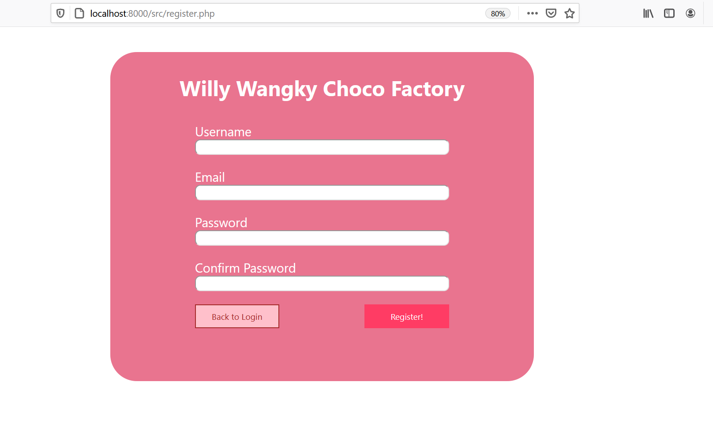
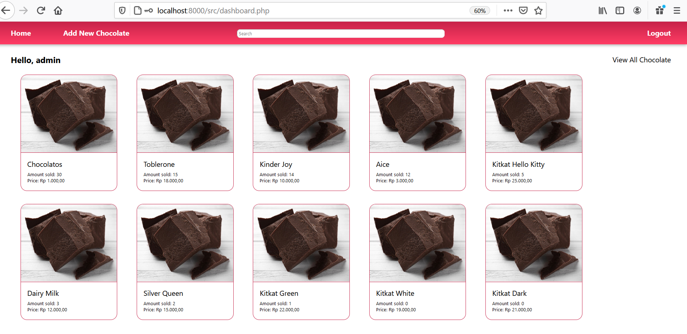
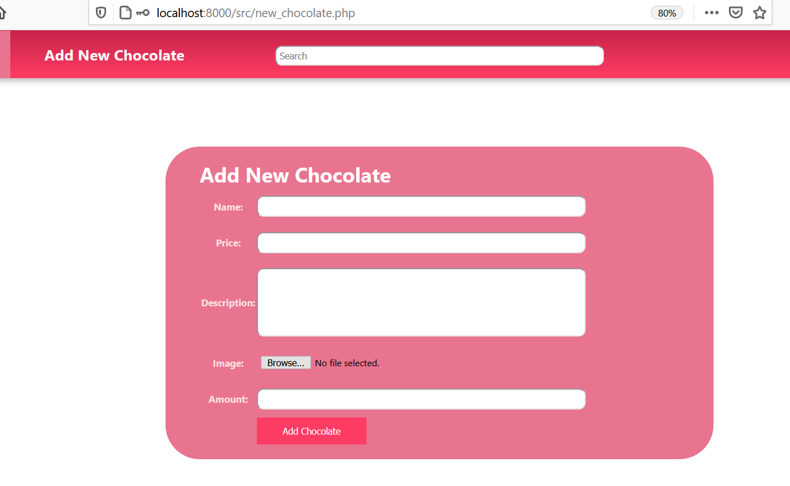
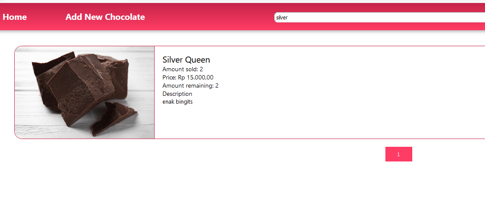
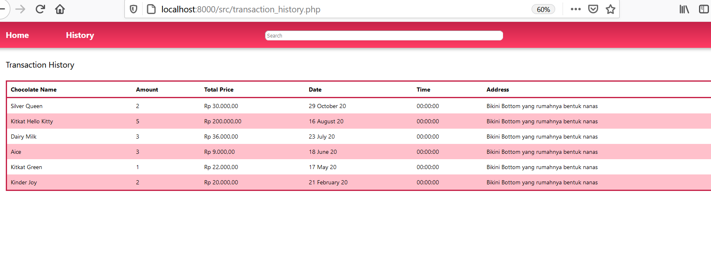
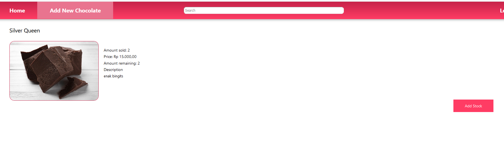

# Willy Wangky Chocolate Online Shop

---

Website Willy Wangky adalah website berbasis php yang digunakan untuk membeli coklat dari pabrik coklat terbesar dan terenak di dunia, Willy Wangky

## Dependency

---

1. [XAMPP](https://www.apachefriends.org/index.html)
2. inisialisasi database (menggunakan `init_db.php` dan `init_dummy_data.php`)
3. Sejauh ini, browser yang support aplikasi kami hanyalah **Mozilla Firefox**, karena ada masalah dengan policy setcookie sehingga kami tidak dapat menambahkan cookie dengan set cookie

## How to Install

---

1. install [XAMPP](https://www.apachefriends.org/index.html)
2. masukkan path directory `php.exe` pada instalasi XAMPP `...xampp\php` (biasanya terdapat di `C:\xampp\php`) ke dalam PATH environment variables.
3. Edit file `db_keys.config.php` pada folder `config` berisi sebagai berikut:

```
         <?php
            define('DB_SERVER', 'INSERT YOUR SERVER URL');
            define('DB_USERNAME', 'INSERT YOUR USERNAME');
            define('DB_PASSWORD', 'INSERT YOUR PASS'); 
            define('DB_NAME', 'INSERT YOUR DB NAME'); 
         ?>
```

4. Jalankan init_db.php pada folder config untuk generate database

## How to Run

---

1. Jalankan XAMPP
2. Start Apache dan MySQL Module pada XAMPP
3. Di direktori tempat repository berada, jalankan:

   ```
   php -S localhost:8000
   ```

   Sebagai contoh digunakan port 8000.

4. Jalankan browser dan pergi ke link `localhost:8000` .
   Sebagai contoh jika ingin pergi ke dashboard, pada project kami dapat dilakukan navigasi ke `localhost:8000/src/dasboard.php`

## Screenshot dari Tugas

---

1. Login 
2. Register 
3. Dashboard 
4. New Chocolate 
5. Search Result 
6. Transaction History 
7. Detail 
8. Buy Chocolate 
9. Add Stock 

## Pembagian Tugas

---

### Frontend

1. Login: 13518125
2. Register: 13518146, 13518125
3. Dashboard: 13518135
4. Chocolate Detail: 13518125, 13518135
5. Buy Chocolate: 13518135
6. Add Chocolate: 13518135
7. Search Results: 13518125
8. Transaction History: 13518135
9. New Chocolate: 13518146, 13518125

### Backend

1. Login: 1351846
2. Register: 13518146
3. Dashboard: 13518135
4. Chocolate Detail: 13518125
5. Buy Chocolate: 13518125, 13518135, 13518146
6. Add Chocolate: 13518125, 13518135, 13518146
7. Search Results: 13518125
8. Transaction History: 13518135, 13518146
9. New Chocolate: 13518146
10. DB Model: 13518146

### Bonus

1. Expire time session at DB: 13518146
2. AJAX di real-time stock (partial)